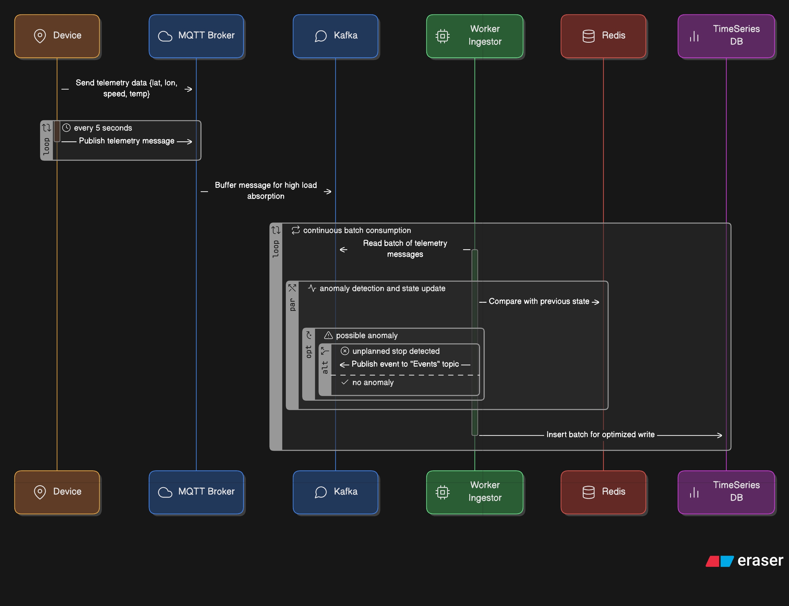

# Telematics Event Architecture

## Reto Técnico: Arquitecto de Software - Plataforma de Monitoreo de Flotas

Este repositorio contiene la propuesta de arquitectura de software para el reto técnico de **Arquitecto de Software** para **CCS (Compañía Colombiana de Seguimiento de Vehículos)**.

### Contexto del Negocio

El sistema consolida diversas señales (GPS, velocidad, sensores de carga, temperatura, botones de pánico) de una flota diversa (camiones, transporte público, motos) y ejecuta acciones predefinidas en caso de eventos anómalos o emergencias.

---

## 1. Arquitectura Propuesta: Event-Driven Architecture (EDA)

La solución se basa en un modelo orientado a eventos y microservicios, diseñado para garantizar el desacoplamiento, la escalabilidad horizontal y la tolerancia a fallos.

### Objetivos Críticos Cumplidos

| Requisito | Valor | Estrategia Implementada |
| :--- | :--- | :--- |
| **Latencia Crítica** | Acciones en **< 2 segundos** | **Carril Rápido (Priority Queue):** Tópico exclusivo en Kafka y consulta en caché (Redis) para evitar I/O de disco. |
| **Rendimiento** | **500 señales/segundo** | **Buffer con Kafka:** Desacopla la ingesta del procesamiento. **Bulk Inserts:** Escritura eficiente en TimescaleDB. |
| **Escalabilidad** | Crecimiento 20% anual | **Microservicios:** Escalado horizontal independiente de cada componente (Ingestor, Rules Engine, Notifier). |

### Componentes Principales

| Componente | Función Principal | Disponibilidad / Escalabilidad |
| :--- | :--- | :--- |
| **Microservicios (NestJS)** | Lógica de negocio (Ingestor, Rules Engine, Notifier). | **Horizontal Scaling:** Múltiples réplicas en Docker. |
| **Apache Kafka** | Buffer de eventos y bus de mensajería. | **Alta Disponibilidad:** Clúster de brokers. Garantiza que no se pierdan datos ante picos de tráfico. |
| **Redis** | Caché de reglas y estado del vehículo. | **Baja Latencia:** Acceso en memoria para decisiones en tiempo real (< 10ms). |
| **PostgreSQL** | Datos transaccionales (Usuarios, Vehículos). | **Integridad:** Datos relacionales consistentes. |
| **TimescaleDB** | Datos de telemetría (Series de Tiempo). | **Particionamiento:** Optimizado para ingesta masiva y consultas por rangos de tiempo. |

---

## 2. Flujos de Datos Detallados

### A. Flujo de Pánico (Emergencia) - "Fast Track"

**Objetivo:** Ejecutar acciones en < 2 segundos.

1.  La señal entra a un tópico prioritario en Kafka (`panic-priority`).
2.  El motor de reglas consulta **Redis** (Memoria), evitando la latencia de la base de datos SQL.
3.  Se dispara la notificación inmediatamente.


### B. Flujo de Telemetría Masiva - "Fire and Forget"

**Objetivo:** Procesar 500 señales/segundo sin perder datos.

1.  **Ingesta:** El dispositivo envía la señal. El Ingestor la valida y la pone en Kafka (`telemetry-stream`).
2.  **Buffer:** Kafka retiene los mensajes, actuando como válvula de presión.
3.  **Procesamiento:** Los consumidores leen a su propio ritmo.
4.  **Persistencia:** Se usan inserciones por lotes (Batch Insert) en TimescaleDB.



---

## 3. Estructura del Proyecto (Monorepo)

El proyecto utiliza **NestJS** con estructura de monorepo:

*   `apps/`: Microservicios independientes.
    *   `ingestor`: Recibe señales HTTP/MQTT y las publica en Kafka.
    *   `rules-engine`: Procesa las señales contra las reglas definidas.
    *   `notifier`: Envía notificaciones (Email, SMS, Push).
*   `libs/`: Librerías compartidas.
    *   `common`: Configuraciones, DTOs, constantes y módulos reutilizables (Database, Kafka, Cache).
*   `docker-compose.local.yml`: Orquestación de contenedores para desarrollo local.
*   `scripts/`: Scripts de utilidad (Seed data).

---

## 4. Puesta en Marcha

### Prerrequisitos
*   Docker y Docker Compose instalados.
*   Node.js (Opcional, para desarrollo local fuera de Docker).

### Configuración Inicial

1.  **Configurar variables de entorno:**
    Renombra el archivo `.env.example` a `.env`:
    ```bash
    cp .env.example .env
    ```
    *Puedes ajustar las variables según tus necesidades (puertos, credenciales, etc.).*

### Ejecución en Modo Desarrollo (Local)

1.  **Levantar la infraestructura:**
    ```bash
    docker-compose -f docker-compose.local.yml up --build
    ```
    *Este modo incluye hot-reload para desarrollo activo.*

2.  **Cargar Datos de Prueba (Seeding):**
    El proyecto incluye un endpoint para poblar la base de datos con vehículos y reglas de prueba.
    ```bash
    curl -X POST http://localhost:3000/ingestion/seed
    ```
    *Esto creará 5 vehículos, usuarios y reglas de ejemplo.*

### Ejecución en Modo Producción

1.  **Levantar la infraestructura optimizada:**
    ```bash
    docker-compose -f docker-compose.prod.yml up --build
    ```
    *Este modo utiliza builds optimizados con multi-stage Dockerfiles, sin dependencias de desarrollo.*

---

## 5. Pruebas y Verificación

### Test Coverage
El proyecto cuenta con una cobertura de pruebas unitarias superior al **50%**, asegurando la calidad de los componentes críticos.

### API Documentation (Swagger)
Puedes probar los endpoints del Ingestor directamente desde la interfaz de Swagger:

👉 **URL:** [http://localhost:3000/api](http://localhost:3000/api)

### Prueba Manual de Señal
Para simular el envío de una señal de GPS:

```bash
curl -X POST http://localhost:3000/ingestion/signal \
  -H "Content-Type: application/json" \
  -d '{
    "vehicleId": 1,
    "signalType": "gps",
    "value": 80,
    "latitude": 4.7110,
    "longitude": -74.0721
  }'
```
